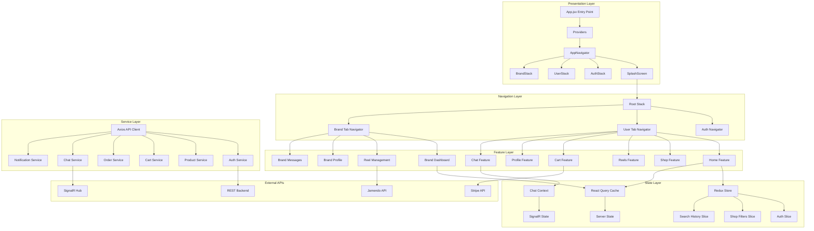
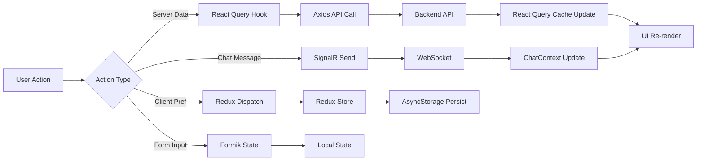
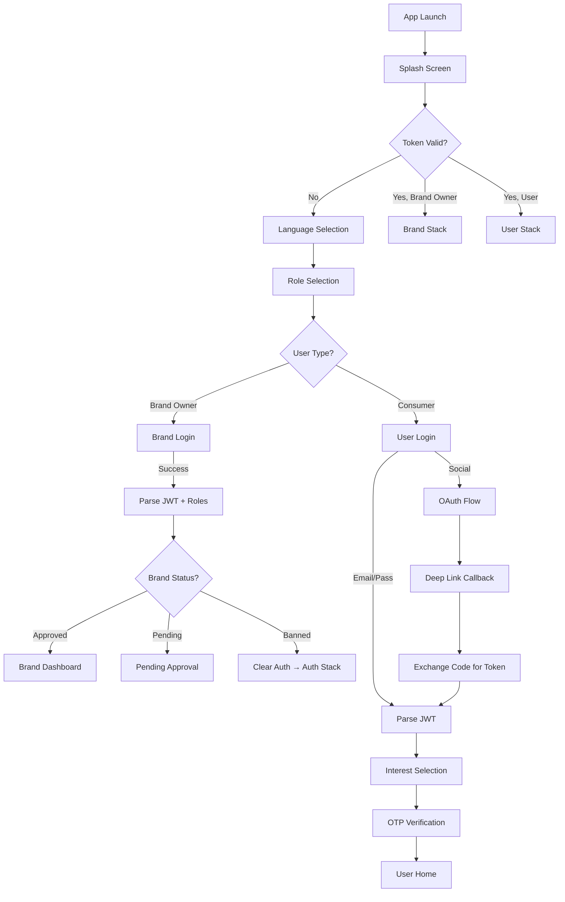
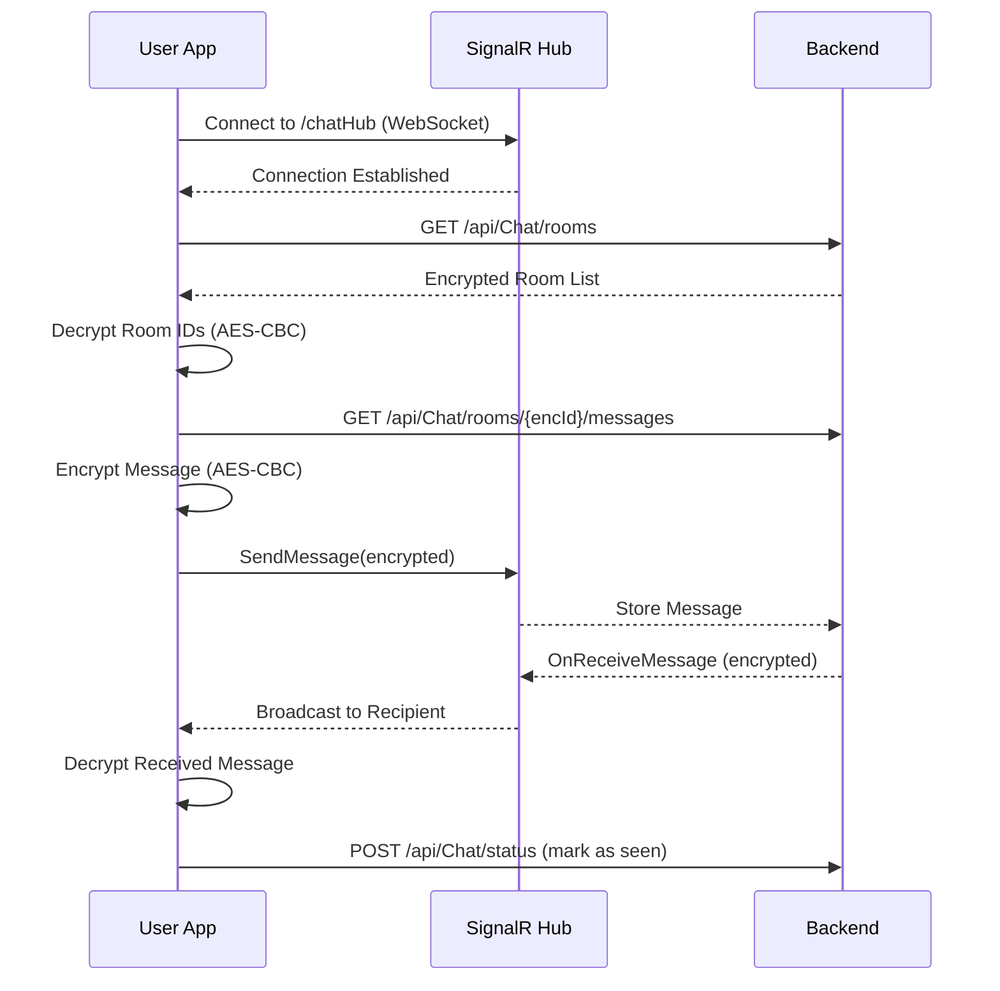
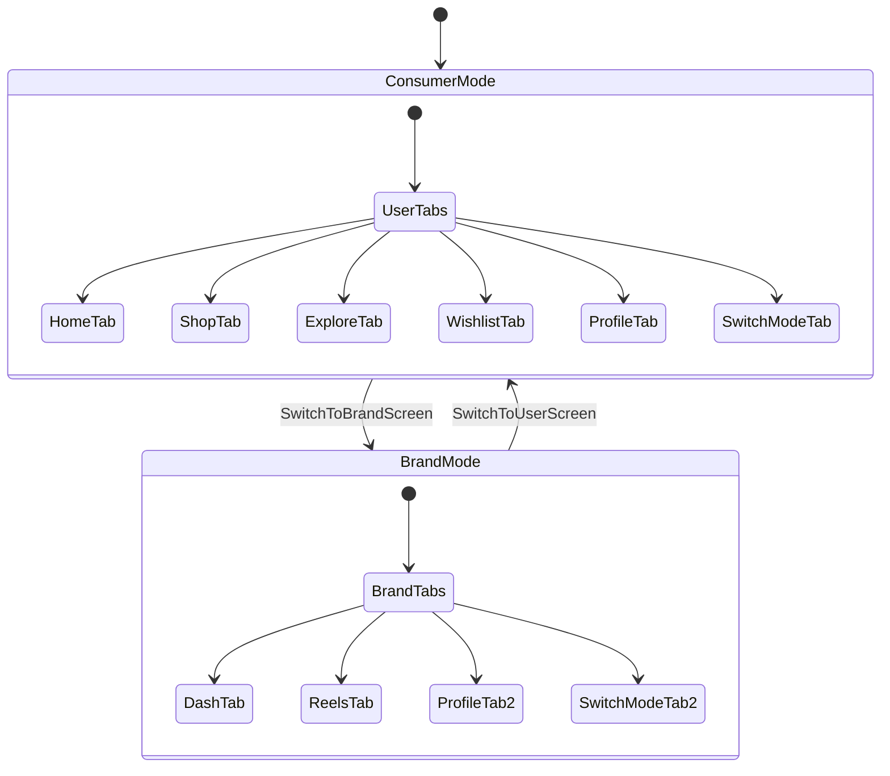

# 1. Mobile Application Analysis

## 1.1 Introduction

The rapid growth of mobile commerce (m-commerce) has fundamentally reshaped the retail landscape, compelling businesses to adopt innovative strategies for customer engagement. Traditional e-commerce platforms, while effective, often fail to replicate the immersive, entertainment-driven shopping experiences that modern consumers demand. The convergence of short-form video content and online shopping—a phenomenon commonly referred to as "shoppertainment" or "reels commerce"—represents a paradigm shift in how consumers discover, evaluate, and purchase products.

ALLUVO is a React Native mobile application that addresses this convergence by integrating TikTok-style vertical video reels with a full-featured e-commerce platform. The application enables brands to create and manage short-form video content showcasing their products, while consumers can browse reels, discover products, and complete purchases—all within a single, unified experience. The platform supports a dual-role system wherein users may operate as both consumers and brand owners, seamlessly switching between perspectives as needed.

This chapter provides a comprehensive technical analysis of the ALLUVO mobile application. It examines the project architecture, technology stack, navigation structure, state management patterns, API integrations, security mechanisms, and every implemented feature in detail. All descriptions are grounded exclusively in the actual source code of the project.

---

## 1.2 Project Overview

**Table 1.1 — Project Identity**

| Attribute | Value |
|---|---|
| Application Name | ALLUVO |
| Package Identifier | `com.ashwv.ALLUVO` |
| Framework | React Native (Expo SDK 54, Managed Workflow with Prebuild) |
| React Native Version | 0.81.4 |
| Language | TypeScript (strict mode) |
| JavaScript Engine | Hermes |
| New Architecture | Enabled |
| Orientation | Portrait only |
| Target Platforms | Android (primary), iOS (configured but not built) |
| EAS Project ID | `99aae79f-4c9a-4aa8-a9aa-6766f69ec9d8` |

The application operates on a client-server architecture where the mobile client communicates with a RESTful API backend hosted at `https://dev.api.alluvo.life`. A separate chatbot service is hosted at `https://chatbot.ai.alluvo.life`. The project contains approximately 200 source files organized across feature-based modules, 28 custom SVG icon components, 46 image assets, and 13 custom font files.

---

## 1.3 Technologies Used

### 1.3.1 Core Framework and Runtime

The application is built on **React Native 0.81.4** using **Expo SDK 54** in managed workflow mode with prebuild generation for the Android native directory. The **Hermes** JavaScript engine is enabled for optimized startup performance and reduced memory consumption. The **New Architecture** (Fabric renderer and TurboModules) is activated, providing improved bridgeless communication between JavaScript and native layers.

### 1.3.2 Programming Language

**TypeScript** is used throughout the project with strict mode enabled (`"strict": true` in `tsconfig.json`). The entry point file (`App.jsx`) uses JSX, while all feature modules, services, hooks, and components are authored in TypeScript (`.tsx` / `.ts`). Custom type declarations are provided for modules lacking native type definitions (`react-native-vector-icons`, `react-native-multi-slider`, SVG imports).

### 1.3.3 Complete Technology Stack

**Table 1.2 — Technology Stack**

| Category | Technology | Purpose |
|---|---|---|
| UI Framework | React Native + Expo | Cross-platform mobile development |
| Navigation | React Navigation 7 (native-stack, bottom-tabs, drawer) | Screen routing and navigation |
| State Management | Redux Toolkit + redux-persist | Client-side state persistence |
| Server State | TanStack React Query 5 | API data fetching and caching |
| HTTP Client | Axios 1.12 | REST API communication |
| Real-time (Notifications) | Microsoft SignalR | WebSocket push notifications |
| Real-time (Chat) | SignalR + Socket.IO | Bidirectional chat messaging |
| Payments | Stripe React Native | Credit/debit card processing |
| Forms | Formik + Yup | Form management and validation |
| Internationalization | i18next + react-i18next + expo-localization | English/Arabic bilingual support |
| Camera | expo-camera | Reel video recording |
| Video Playback | expo-video + expo-av | Video and audio rendering |
| Audio | expo-audio | Music playback for reel preview |
| Animations | react-native-reanimated | High-performance UI animations |
| Gestures | react-native-gesture-handler | Touch gesture handling |
| UI Components | React Native Paper | Material Design component library |
| Gradients | expo-linear-gradient | Gradient backgrounds and text |
| SVG | react-native-svg + react-native-svg-transformer | Vector graphics rendering |
| Images | expo-image-picker | Camera and gallery image selection |
| Fonts | expo-font (CinzelDecorative, Poppins, Inter) | Custom typography |
| Storage | AsyncStorage + expo-secure-store | Persistent and secure local storage |
| Location | expo-location + react-native-maps | Geolocation and map display |
| Push Notifications | expo-notifications | Device push notification delivery |
| Clipboard | expo-clipboard | Text copy functionality |
| Deep Linking | expo-linking | OAuth redirect URI handling |
| Code Splitting | expo-updates | Over-the-air code updates |
| Encryption | CryptoJS | AES-CBC end-to-end chat encryption |
| JWT | jwt-decode | Token payload extraction |
| Lottie | lottie-react-native | Animated illustrations |
| Charts | react-native-chart-kit | Brand analytics visualizations |
| Step Indicators | react-native-step-indicator | Multi-step form progress display |
| Bottom Sheet | react-native-raw-bottom-sheet | Modal bottom sheet overlays |
| HTML Rendering | react-native-render-html | Rich text and policy display |
| WebView | react-native-webview | Embedded web content |
| Music API | Jamendo API (v3.0) | Free music track integration |

---

## 1.4 Architecture

### 1.4.1 Architectural Pattern

The application follows a **feature-based modular architecture** combined with a **provider hierarchy pattern**. Each business domain (auth, user, brand, address) is encapsulated in its own feature module containing screens, components, hooks, services, types, and data files. This approach promotes separation of concerns, code discoverability, and independent development of features.

The provider hierarchy wraps the application in the following order, as defined in `App.jsx`:

```
GestureHandlerRootView
  └─ Redux Provider (store)
       └─ React Query ClientProvider
            └─ React Native Paper Provider (theme)
                 └─ NavigationContainer
                      └─ AppNavigator
                           └─ SignalR Connection (useSignalR hook)
```

### 1.4.2 Architecture Diagram



### 1.4.3 Data Flow Architecture

The application employs a hybrid data flow model:

1. **Server State** (products, orders, profiles) is managed through TanStack React Query, providing automatic caching, background refetching, and stale-while-revalidate semantics.
2. **Client State** (authentication token, user roles, search history, shop filters) is managed through Redux Toolkit with persistence via redux-persist to AsyncStorage.
3. **Real-time State** (chat messages, notification counts) is managed through React Context (ChatContext) with SignalR WebSocket connections.
4. **Form State** is managed locally through Formik with Yup schema validation.



---

## 1.5 Folder Structure

The project follows a feature-based directory organization:

```
MobileAppReelsCommerece/
├── App.jsx                          # Root component with providers
├── index.js                         # Entry point (registerRootComponent)
├── .env                             # Environment variables
├── app.json                         # Expo configuration
├── eas.json                         # EAS Build configuration
├── metro.config.ts                  # Metro bundler (SVG transformer)
├── tsconfig.json                    # TypeScript configuration
├── declarations.d.ts                # SVG module declaration
├── theme/
│   ├── colors.ts                    # Color palette definitions
│   └── index.ts                     # Barrel re-export
├── types/
│   ├── index.ts                     # Global type declarations
│   └── *.d.ts                       # Module declaration shims
├── services/
│   └── apiClient.ts                 # Axios instance with auth interceptor
├── src/
│   ├── assests/
│   │   ├── animation/               # Lottie animation files
│   │   ├── fonts/                   # Custom font files (13)
│   │   ├── icons/                   # Static icon assets
│   │   └── imgs/                    # Image assets (46 files)
│   ├── Components/                  # Shared/reusable UI components
│   │   ├── auth/                    # Auth-specific shared components
│   │   ├── buttons/                 # GradientButton, GradientRadioButton
│   │   ├── cards/                   # Notification, Success, Product cards
│   │   │   └── product cards/       # BrandProfile, Cart, Shop grid/list
│   │   ├── inputs/                  # AuthInput, DateInput, PhoneInput, SimpleInput
│   │   └── special/                 # Badge, BottomSheet, RangePriceBar
│   ├── config/
│   │   └── env.ts                   # Environment variable configuration
│   ├── features/
│   │   ├── auth/                    # Authentication feature module
│   │   │   ├── hooks/               # useLogin, useRegister, useVerification
│   │   │   ├── screens/             # Login, Signup, OTP, Password, etc.
│   │   │   └── services/            # auth.ts, socialAuth.ts
│   │   ├── brand/                   # Brand Owner feature module
│   │   │   ├── auth/                # Brand login, registration
│   │   │   ├── components/          # Dashboard, Profile, Reel components
│   │   │   ├── hooks/               # useBrandDashboard, useReelManagement
│   │   │   ├── navigation/          # Brand stack, tabs, guards
│   │   │   ├── screens/             # Dashboard, Reels, Messages, Profile
│   │   │   ├── services/            # brandDashboard, reelManagement, etc.
│   │   │   └── types/               # TypeScript interfaces
│   │   ├── user/                    # Consumer feature module
│   │   │   ├── chatContext/          # ChatContext with SignalR
│   │   │   ├── components/          # Home, Shop, Profile components
│   │   │   ├── hooks/               # useCart, useWishlist, useOrders, etc.
│   │   │   ├── screens/             # Home, Shop, Cart, Checkout, etc.
│   │   │   ├── services/            # cart, order, chat, shop, etc.
│   │   │   └── types/               # shop.ts type definitions
│   │   └── address/                 # Address management feature
│   │       ├── api.ts               # CRUD API calls
│   │       ├── components/          # AddressCard, AnimatedInput, etc.
│   │       ├── data/                # countries.ts static data
│   │       ├── screens/             # AddressList, AddEditAddress
│   │       └── types.ts             # Address TypeScript interfaces
│   ├── hooks/
│   │   └── useFloatingTabBarPadding.ts
│   ├── i18n/
│   │   ├── index.ts                 # i18next initialization
│   │   └── translations/            # en.json, ar.json
│   ├── iconComponent/               # 28 SVG icon components
│   ├── Navigation/
│   │   ├── AppNavigator.tsx         # Root navigator
│   │   ├── AuthStack.tsx            # Authentication flow
│   │   ├── UserStack.tsx            # User tab + nested screens
│   │   ├── UserTabs.tsx             # Bottom tab navigator (User)
│   │   ├── BrandStack.tsx           # Brand wrapper
│   │   ├── SharedTabBar.tsx         # Animated floating tab bar
│   │   └── types.ts                 # Navigation type definitions
│   ├── Redux/
│   │   ├── store.ts                 # Configured Redux store
│   │   └── slices/                  # auth, register, shopFilters, searchHistory
│   ├── Screens/
│   │   └── SplashScreen.tsx         # Animated splash screen
│   ├── services/
│   │   └── toastService.ts          # Global toast notification service
│   └── utils/
│       ├── chatHelpers.ts           # AES encryption/decryption
│       ├── imageUtils.ts            # Image processing utilities
│       └── useKeyboardHeight.ts     # Keyboard height hook
```

**Table 1.3 — Module Summary**

| Module | Files | Purpose |
|---|---|---|
| `features/auth/` | 13 | User authentication and registration |
| `features/brand/` | 50+ | Brand owner dashboard and management |
| `features/user/` | 80+ | Consumer-facing functionality |
| `features/address/` | 8 | Address CRUD management |
| `Components/` | 25 | Shared UI components |
| `iconComponent/` | 28 | Custom SVG icons |
| `Navigation/` | 7 | App routing configuration |
| `Redux/` | 5 | State management slices |
| `i18n/` | 3 | Internationalization resources |

---

## 1.6 Navigation

### 1.6.1 Navigation Architecture

The application implements a hierarchical navigation structure using **React Navigation 7** with native stack and bottom tab navigators. The navigation is organized into four distinct stacks managed by the root `AppNavigator`:

```mermaid
graph TB
    ROOT[Root Stack Navigator] --> SPLASH[Splash Screen]
    ROOT --> AUTH[Auth Stack]
    ROOT --> USER[User Stack]
    ROOT --> BRAND[Brand Stack]

    AUTH --> LANG[LanguageSelection]
    AUTH --> ROLE[Role Selection]
    AUTH --> LOGIN[Login]
    AUTH --> REGISTER[Register]
    AUTH --> FORGOT[ForgetPassword]
    AUTH --> VERIFY[VerifyAccount]
    AUTH --> RESET[ResetPassword]
    AUTH --> INTEREST[Interest]
    AUTH --> BLOGIN[BrandLogin]
    AUTH --> BREGISTER[BrandRegister]

    USER --> TABS[User Tabs]
    USER --> BRANDPROFILE[BrandProfile]
    USER --> SETTINGS[Settings]
    USER --> NOTIFICATIONS[Notifications]
    USER --> CHECKOUT[Checkout]
    USER --> CART[Cart]
    USER --> CHAT[ChatScreen]
    USER --> CHATMSG[ChatMessages]
    USER --> PRODUCT[ProductDetails]
    USER --> MORE[+12 more screens]

    TABS --> HOME[Home Tab]
    TABS --> SHOP[Shop Tab]
    TABS --> EXPLORE[Explore Tab]
    TABS --> WISHLIST[Wishlist Tab]
    TABS --> PROFILE[Profile Tab]
    TABS --> SWITCH[SwitchMode Tab]

    BRAND --> BTABS[Brand Tabs]
    BRAND --> BRANDNAV[BrandRootStack]

    BTABS --> BDASH[Dashboard Tab]
    BTABS --> BREELS[Reels Tab]
    BTABS --> BPROFILE[Profile Tab]
    BTABS --> BSWITCH[SwitchMode Tab]
```



### 1.6.2 Navigation Type Definitions

All navigation routes are strongly typed through TypeScript in `src/Navigation/types.ts`. The `RootStackParamList` defines four root screens. The `UserStackParamList` defines 18 routes with parameter types (e.g., `ProductDetails` accepts either `{ product: any }` or `{ productId: number; productName: string }`). The `AuthStackParamList` defines 10 authentication-related routes.

### 1.6.3 Root Navigator (`AppNavigator.tsx`)

The root navigator (`createNativeStackNavigator<RootStackParamList>`) contains four screens:

1. **Splash** — Animated splash screen with auto-navigation logic
2. **Auth** — Authentication stack (wrapped in `GuestGuard`)
3. **User** — Consumer experience (wrapped in `ChatProvider`)
4. **Brand** — Brand owner experience

The `useSignalR()` hook is invoked at this level to establish the notification WebSocket connection globally.

### 1.6.4 Auth Navigator (`AuthStack.tsx`)

The auth navigator is wrapped in a `GuestGuard` that redirects authenticated users away from auth screens. The initial route is `LanguageSelection`. Screens include language selection, role selection, user login/signup, brand login/signup, password recovery, OTP verification, and interest selection.

### 1.6.5 User Navigator (`UserStack.tsx`)

The user navigator wraps its content in a `ChatProvider` context provider. It consists of:

- **UserTabs** — The primary tab-based interface (Home, Shop, Explore, Wishlist, Profile, and conditionally SwitchMode)
- **18 nested screens** — BrandProfile, Settings, ProfileSettings, PaymentMethod, ShippingAddress, AddAddress, Notifications, ContactUs, SearchExplore, ReelDetail, TopBrandsView, ProductDetails, Checkout, Cart, ChatScreen, ChatMessages, OrderDetails, and AboutUs

### 1.6.6 Brand Navigator (`BrandStack.tsx`)

The brand navigator delegates to `BrandRootStack`, which contains:

- **BrandTabs** — Dashboard, Reels, Profile, SwitchMode tabs
- **8 nested screens** — ReelAnalytics, RecordReel, AddReel, ReelDetail, EditReel, Notifications, BrandMessages, BrandChat

### 1.6.7 Shared Animated Tab Bar (`SharedTabBar.tsx`)

Both User and Brand tab navigators share a custom floating tab bar implementation featuring:

- **Floating design** with elevation shadow and rounded corners
- **Gradient indicator** that slides between tabs using `react-native-reanimated`
- **Spring animations** on tab press and selection change
- **Ionic icons** with focused/unfocused state transitions
- **Cart badge** with bounce animation on the Shop tab
- **Switch Mode tab** (conditionally shown when user has Brand Owner role)

The tab bar constants are: height 64px, horizontal margin 16px, bottom offset 16px from safe area, indicator size 44px.

### 1.6.8 Navigation Guards

Two guard components control access:

- **`BrandGuard`** — Verifies authentication token, roles, brand status, and `isInUserMode` state. Fetches brand information if not cached. Redirects banned users to Auth. Prevents non-brand-owners from accessing brand screens.
- **`GuestGuard`** — Prevents authenticated brand owners from accessing the auth flow by redirecting to the Brand stack.

### 1.6.9 Screen Documentation

**Table 1.4 — Complete Screen Registry**

| Screen | Module | Purpose | Navigation Path |
|---|---|---|---|
| SplashScreen | Root | Animated logo display, auto-routing | `Splash` (root) |
| LanguageSelection | Auth | Language picker (EN/AR) | `Auth > LanguageSelection` |
| role | Auth | User/Brand role selection | `Auth > role` |
| LoginScreen | Auth | User email/password login | `Auth > Login` |
| SignupScreen | Auth | Multi-step user registration | `Auth > Register` |
| VerifyAccount | Auth | OTP email verification | `Auth > verifyAccount` |
| ForgetPassword | Auth | Password recovery initiation | `Auth > forgetPassword` |
| ResetPassword | Auth | New password entry | `Auth > resetPassword` |
| Interest | Auth | Interest category selection | `Auth > interest` |
| BrandLoginScreen | Auth | Brand owner login | `Auth > BrandLogin` |
| BrandRegisterScreen | Auth | Multi-step brand registration | `Auth > BrandRegister` |
| HomeUser | User | Home feed (offers, categories, brands, reels) | `User > UserTabs > Home` |
| shop | User | Product catalog with filters | `User > UserTabs > Shop` |
| Explore | User | Search and discovery | `User > UserTabs > Explore` (mapped as "Reels") |
| ReelsUser | User | Vertical reels feed | `User > UserTabs > Explore` |
| WishlistUser | User | Saved products | `User > UserTabs > Wishlist` |
| ProfileUser | User | Profile overview and settings | `User > UserTabs > Profile` |
| SwitchToBrandScreen | User | Switch to brand mode | `User > UserTabs > SwitchMode` |
| ProductDetails | User | Product detail view | `User > ProductDetails` |
| CartUser | User | Shopping cart | `User > Cart` |
| Checkout | User | Order checkout flow | `User > Checkout` |
| Notifications | User | Notification feed | `User > Notifications` |
| ChatScreen | User | Chat room list | `User > ChatScreen` |
| ChatMessages | User | Chat conversation | `User > ChatMessages` |
| BrandProfile | User | Brand store front | `User > BrandProfile` |
| BrandReels | User | Brand-specific reels | `User > BrandReels` |
| Settings | User | App settings | `User > Settings` |
| ProfileSettings | User | Edit profile | `User > ProfileSettings` |
| PaymentMethod | User | Payment management | `User > PaymentMethod` |
| AddressListScreen | User | Shipping addresses | `User > ShippingAddress` |
| AddEditAddressScreen | User | Add/edit address form | `User > AddAddress` |
| OrderDetailsScreen | User | Order detail view | `User > OrderDetails` |
| AboutUs | User | About information | `User > AboutUs` |
| ContactUs | User | Contact form | `User > ContactUs` |
| TopBrandsView | User | All brands list | `User > TopBrandsView` |
| SearchExplore | User | Search results | `User > SearchExplore` |
| BrandHomeScreen | Brand | Brand dashboard | `Brand > BrandRoot > BrandTabs > Home` |
| ReelsListScreen | Brand | Brand reels management | `Brand > BrandRoot > BrandTabs > Reels` |
| ProfileScreen | Brand | Brand profile settings | `Brand > BrandRoot > BrandTabs > Profile` |
| SwitchToUserScreen | Brand | Switch to user mode | `Brand > BrandRoot > BrandTabs > SwitchMode` |
| AddReelScreen | Brand | Create new reel | `Brand > BrandRoot > AddReel` |
| EditReelScreen | Brand | Edit existing reel | `Brand > BrandRoot > EditReel` |
| RecordReelScreen | Brand | Camera reel recording | `Brand > BrandRoot > RecordReel` |
| ReelAnalyticsScreen | Brand | Reel performance analytics | `Brand > BrandRoot > ReelAnalytics` |
| BrandMessagesScreen | Brand | Brand messages list | `Brand > BrandRoot > BrandMessages` |
| BrandChatScreen | Brand | Brand chat conversation | `Brand > BrandRoot > BrandChat` |

---

## 1.7 State Management

### 1.7.1 Redux Toolkit with Persistence

The application employs **Redux Toolkit** for client-side state management with **redux-persist** configured to use `AsyncStorage` as the storage backend.

**Table 1.5 — Redux Store Configuration**

| Setting | Value |
|---|---|
| Store | `configureStore` from Redux Toolkit |
| Persistence | `redux-persist` with `AsyncStorage` |
| Persistence Key | `"root"` |
| Whitelisted Slices | `auth`, `searchHistory` |
| Excluded Middleware | `FLUSH`, `REHYDRATE`, `PAUSE`, `PERSIST`, `PURGE`, `REGISTER` (serializable check) |

### 1.7.2 Redux Slices

#### Auth Slice (`authSlice.ts`)

Manages authentication state with the following fields:

| Field | Type | Purpose |
|---|---|---|
| `token` | `string \| null` | JWT access token |
| `roles` | `string[] \| null` | User roles (e.g., "Brand Owner") |
| `brandStatus` | `string \| null` | Brand approval status |
| `brandName` | `string \| null` | Brand display name |
| `isInUserMode` | `boolean` | Current view mode toggle |

Actions: `setToken`, `setRoles`, `setBrandStatus`, `setBrandName`, `setUserMode`, `clearAuth`

#### Register Slice (`registerSlice.ts`)

Manages user registration with an async thunk (`registerUser`) that performs multipart form data upload via the Fetch API (due to Axios limitations with React Native FormData). Tracks `loading`, `success`, `error`, `message` (bilingual), and `fieldErrors` states.

#### Shop Filters Slice (`shopFiltersSlice.ts`)

Manages product filtering state for the shop screen:

| Field | Type | Purpose |
|---|---|---|
| `mainCategory` | `mainCategoryType[]` | Selected categories |
| `priceRange` | `number[]` | Min/max price bounds [100, 800] |
| `stockStatus` | `string \| null` | In-stock/out-of-stock filter |
| `sizesSelected` | `sizeType[]` | Selected sizes |
| `colors` | `colorType[]` | Selected colors |
| `Search` | `string` | Search query text |
| `SortItem` | `sortOptionType \| null` | Sort criteria |

Actions include toggle operations for colors and sizes, and a `clearAllFilters` reset action.

#### Search History Slice (`searchHistorySlice.ts`)

Maintains a capped list (maximum 10) of recent search keywords with deduplication and case-insensitive matching.

### 1.7.3 React Query (TanStack Query)

**TanStack React Query 5** manages all server-state interactions. The `QueryClient` is instantiated at the application root. Key query configurations include:

- **Stale time**: 5 minutes for categories, offers, and brand data
- **GC time**: 30 minutes for cached data
- **Query keys**: Namespaced by feature (e.g., `["cart"]`, `["notifications"]`, `["brand-reels", filter]`)
- **Mutations**: Optimistic updates for notifications, cart operations, and order management with query invalidation on success

### 1.7.4 React Context (ChatContext)

The `ChatContext` provides real-time chat state management through a React Context provider. It encapsulates:

- SignalR hub connection for bidirectional messaging
- Chat room list with encrypted room IDs
- Message history with pagination
- Optimistic message sending with queue management
- Chatbot messaging integration
- Message read status tracking
- AES-CBC encrypted message content

The context exposes 25+ state values and methods to consuming components through `ChatContext.Provider`.

---

## 1.8 API Integration

### 1.8.1 API Client Configuration

The application uses a centralized Axios instance (`services/apiClient.ts`) with the following configuration:

| Setting | Value |
|---|---|
| Base URL | `https://dev.api.alluvo.life/` |
| Timeout | 60,000 ms |
| Content-Type | `application/json` |
| Accept | `application/json` |
| Auth | Bearer token from Redux store (injected via request interceptor) |

The request interceptor reads the current Redux state to extract the JWT token and attaches it to every outgoing request as a `Bearer` authorization header.

### 1.8.2 Complete API Endpoint Registry

**Table 1.6 — Authentication APIs**

| Endpoint | Method | Purpose |
|---|---|---|
| `/api/Auth/Login` | POST | User login |
| `/api/Auth/Register` | POST | User registration (multipart FormData) |
| `/api/Auth/ForgetPassword` | POST | Password recovery |
| `/api/Auth/ResetPassword` | POST | Password reset |
| `/api/Auth/UserInfo` | GET | Get current user profile |
| `/api/Otp/VerifyOtp` | POST | OTP verification |
| `/api/Otp/ResendOtp` | POST | Resend OTP |
| `/api/GoogleAuth/login` | GET | Google OAuth initiation |
| `/api/GoogleAuth/exchange` | POST | Google OAuth code exchange |
| `/api/TikTokAuth/login` | GET | TikTok OAuth initiation |
| `/api/TikTokAuth/exchange` | POST | TikTok OAuth code exchange |

**Table 1.7 — Product & Shop APIs**

| Endpoint | Method | Purpose |
|---|---|---|
| `/api/Product` | GET | Get products (with pagination & filters) |
| `/api/Product/{id}` | GET | Get product details |
| `/api/Product/categories` | GET | Get product categories |
| `/api/Product/{id}/view` | POST | Track product view |
| `/api/Product/recentviews` | GET | Get recently viewed products |
| `/api/TodayOffer/today offers` | GET | Get today's offers |

**Table 1.8 — Cart & Order APIs**

| Endpoint | Method | Purpose |
|---|---|---|
| `/api/Cart` | GET | Get cart contents |
| `/api/Cart` | POST | Add items to cart |
| `/api/Cart` | PUT | Update cart items |
| `/api/Cart` | DELETE | Clear cart |
| `/api/Order` | POST | Create order |
| `/api/Order/MyOrders` | GET | Get user's orders |
| `/api/Order/{id}` | GET | Get order details |
| `/api/Order/{id}` | DELETE | Cancel order |
| `/api/Order/{id}/status` | PUT | Update order status |
| `/api/Order/Summary` | POST | Get order summary |
| `/api/Payment/pay` | POST | Process card payment |

**Table 1.9 — Reels APIs**

| Endpoint | Method | Purpose |
|---|---|---|
| `/api/Reel/forYou` | GET | For You reels feed (paginated) |
| `/api/Reel/following` | GET | Following reels feed (paginated) |
| `/api/Reel/toggle-like/{id}` | POST | Toggle reel like |
| `/api/Reel/TrackReelView` | POST | Track reel view duration |
| `/api/ReelComment/{reelId}` | GET | Get reel comments (paginated) |
| `/api/ReelComment/AddComment` | POST | Add comment to reel |
| `/api/ReelComment/toggle-like` | POST | Toggle comment like |

**Table 1.10 — Brand APIs**

| Endpoint | Method | Purpose |
|---|---|---|
| `/api/Brand/my` | GET | Get current brand info |
| `/api/Brand/BrandInfo/{id}` | GET | Get brand information |
| `/api/Brand/BrandPolicy` | GET | Get brand policies |
| `/api/Brand/GetReviewsForBrand` | GET | Get brand reviews |
| `/api/Brand/ToggleFollow/{id}` | POST | Toggle brand follow |
| `/api/Brand/FollowedBrands` | GET | Get followed brands |
| `/api/Brand/ToggleLikeToReview` | POST | Like a review |
| `/api/Brand/ToggleDislikeToReview` | POST | Dislike a review |
| `/api/BrandOwner/{brandId}` | GET | Get brand owner info |
| `/api/BrandDetails/{id}` | GET | Get brand details |
| `/api/BrandDetails/{id}` | PUT | Update brand details |
| `/api/BrandDetails/{id}/logo` | POST | Upload brand logo |
| `/api/BrandDetails/{id}/logo` | DELETE | Delete brand logo |
| `/api/BrandDetails/{id}/cover` | POST | Upload brand cover |
| `/api/BrandDetails/{id}/cover` | DELETE | Delete brand cover |
| `/api/BrandDetails/{id}/top-engaged-users` | GET | Top engaged users |

**Table 1.11 — Reel Management APIs**

| Endpoint | Method | Purpose |
|---|---|---|
| `/api/ReelManagement` | POST | Create reel (multipart) |
| `/api/ReelManagement` | PATCH | Edit reel |
| `/api/ReelManagement` | DELETE | Delete reel |
| `/api/ReelManagement/Reels` | GET | Get brand reels (filtered) |
| `/api/ReelManagement/{id}` | GET | Get reel by ID |
| `/api/ReelManagement/Products` | GET | Get brand products for selection |

**Table 1.12 — User Profile & Settings APIs**

| Endpoint | Method | Purpose |
|---|---|---|
| `/api/UserProfile/UpdateProfile` | PUT | Update profile info |
| `/api/UserProfile/UpdatePassword` | PUT | Update password |
| `/api/UserProfile/UpdateProfileImage` | PUT | Update profile image (multipart) |
| `/api/UserProfile/ShippingAddress` | GET | Get addresses |
| `/api/UserProfile/ShippingAddress` | POST | Add address |
| `/api/UserProfile/ShippingAddress/{id}` | PATCH | Update address |
| `/api/UserProfile/ShippingAddress/{id}` | DELETE | Delete address |
| `/api/UserProfile/RequestDeleteAccountOtp` | POST | Request account deletion OTP |
| `/api/UserProfile/DeleteAccount` | DELETE | Confirm account deletion |

**Table 1.13 — Chat & Notification APIs**

| Endpoint | Method | Purpose |
|---|---|---|
| `/api/Chat/rooms` | GET | Get chat room list |
| `/api/Chat/room` | POST | Create chat room |
| `/api/Chat/rooms/{id}/messages` | GET | Get room messages (paginated) |
| `/api/Chat/message` | POST | Send message |
| `/api/Chat/status` | POST | Mark messages as read |
| `/api/Chat/rooms/unreadCount/{id}` | GET | Get unread count |
| `/api/Chat/room/{id}` | DELETE | Delete chat room |
| `/api/Chat/message/{id}` | DELETE | Delete message |
| `/api/Notification` | GET | Get notifications |
| `/api/Notification/{id}/read` | PATCH | Mark notification as read |
| `/api/Notification/mark-all-read` | PUT | Mark all as read |
| `/api/Notification/unread-count` | GET | Get unread count |
| `/api/Notification/{id}` | DELETE | Delete notification |
| `/api/Notification/clear-all` | DELETE | Clear all notifications |
| `/api/notificationHub` | WebSocket | SignalR notification hub |
| `/api/chatHub` | WebSocket | SignalR chat hub |

**Table 1.14 — Dashboard & Analytics APIs**

| Endpoint | Method | Purpose |
|---|---|---|
| `/api/Dashboard/brand-stats` | GET | Brand dashboard statistics |
| `/api/Dashboard/brand-reel-analytics` | GET | Reel performance analytics |
| `/api/Reel/GetTopReels` | GET | Top performing reels |
| `/api/Order/GetOrdersForBrand` | GET | Brand orders |
| `/api/Product/GetTopProducts` | GET | Top products |
| `/api/Product?BrandId={id}` | GET | Brand's products |

**Table 1.15 — Lookup APIs**

| Endpoint | Method | Purpose |
|---|---|---|
| `/api/Lookup/countries` | GET | Country list |
| `/api/Lookup/cities` | GET | City list |
| `/api/Lookup/colors` | GET | Color options |
| `/api/Lookup/sizes` | GET | Size options |
| `/api/Lookup/order-statuses` | GET | Order status options |
| `/api/Lookup/stock-statuses` | GET | Stock status options |
| `/api/Lookup/payment-statuses` | GET | Payment status options |
| `/api/Lookup/payment-methods` | GET | Payment method options |
| `/api/Lookup/information-types` | GET | Info type options |
| `/api/Lookup/dispute-statuses` | GET | Dispute status options |
| `/api/Lookup/reel-statuses` | GET | Reel status options |
| `/api/Lookup/delivery-methods` | GET | Delivery method options |

---

## 1.9 Authentication

### 1.9.1 Authentication Flow

The application implements a multi-method authentication system supporting email/password login, social OAuth (Google and TikTok), and role-based access for both consumers and brand owners.



### 1.9.2 Login Implementation

The `LoginScreen` accepts email and password credentials, dispatching to the `/api/Auth/Login` endpoint via the `useLogin` hook. On success, the JWT token is extracted from the response and stored in the Redux auth slice. The JWT is then decoded to extract user roles and the user ID:

```typescript
dispatch(setToken(data?.data?.token));
```

The token is subsequently used by the Axios interceptor to authenticate all API requests and by the SignalR connections for WebSocket authentication.

### 1.9.3 Registration Implementation

User registration is a multi-step process managed by Formik with Yup validation schema:

1. **Personal Information** — First name, last name, email, phone number, date of birth, gender
2. **Profile Image** — Camera or gallery image selection
3. **Password** — Password creation with confirmation
4. **Verification** — OTP email verification

The registration API uses `FormData` for multipart file upload via the Fetch API (not Axios) due to known limitations with Axios FormData handling in React Native. The `registerSlice` manages the async thunk lifecycle with proper error handling for field-level validation errors.

### 1.9.4 Social Authentication

The application supports OAuth 2.0 flows for **Google** and **TikTok**:

1. The client constructs a redirect URI using `expo-linking`
2. The user is redirected to the OAuth provider's login page via deep linking
3. On successful authentication, the provider redirects back with an authorization code
4. The code and state are exchanged for a JWT token via `/api/GoogleAuth/exchange` or `/api/TikTokAuth/exchange`

### 1.9.5 OTP Verification

After registration or password reset, a 6-digit OTP is sent to the user's email. The `VerifyAccount` screen implements a digit-by-digit input interface with auto-advance, paste support, and a 60-second countdown timer for resend functionality. The `useVerification` hook dispatches the token to Redux upon successful verification.

### 1.9.6 Brand Owner Authentication

Brand owners have a separate login (`BrandLoginScreen`) and registration (`BrandRegisterScreen`) flow. The brand registration is a multi-step wizard with account information, brand details, document upload, and OTP verification steps. Brand accounts require admin approval, with the `BrandGuard` component checking the `brandStatus` field and redirecting banned users to the auth stack.

### 1.9.7 JWT Token Handling

The JWT token serves multiple purposes:

1. **API Authentication** — Injected as `Bearer` token in the Axios interceptor
2. **User ID Extraction** — Decoded from the `http://schemas.xmlsoap.org/ws/2005/05/identity/claims/nameidentifier` claim
3. **SignalR Authentication** — Passed as `accessTokenFactory` in hub connections
4. **Role Determination** — Roles extracted from token claims for route guarding

---

## 1.10 Major Features

### 1.10.1 Reels Video Feed

The reels feature provides a TikTok-style vertical video browsing experience integrated with e-commerce product tagging.

**User-Facing Reels (`ReelsUser.tsx`, 651 lines)**

The reels feed is implemented using `react-native-pager-view` for vertical swiping between full-screen video items. Each reel item includes:

- **Video Player** — Full-screen video playback using `expo-video`
- **Brand Overlay** — Brand avatar, name, and follow button
- **Engagement Controls** — Like button (with optimistic toggle), comment count, product tag count
- **Product Tags** — Animated product cards showing name, price, discount, and rating
- **Action Buttons** — Like, comment, share, and product detail navigation

The feed supports two modes:
- **For You** — Algorithmically ranked content fetched from `/api/Reel/forYou`
- **Following** — Content from followed brands fetched from `/api/Reel/following`

Both feeds implement infinite scroll pagination with the `useReels` hook managing page state, loading indicators, and append logic. The `useReelViewTracker` hook monitors video watch duration and reports view metrics to the backend.

**Brand Reels Management (`ReelsListScreen.tsx`, 732 lines)**

Brand owners can manage their reels through a filterable, searchable list with:

- Status-based filtering (Published, Pending, Draft)
- Search by title
- Sort options (Newest, Oldest, Most Viewed, Most Liked)
- Reel cards showing title, status badge, view count, like count, and action menu
- Navigation to edit, analytics, and detail screens

### 1.10.2 Reel Recording and Creation

**RecordReelScreen (364 lines)**

The recording screen uses `expo-camera` with the `CameraView` component to capture video:

- **Camera Controls** — Front/back camera toggle, torch on/off, close button
- **Recording Timer** — 60-second maximum with animated countdown indicator
- **Recording States** — Idle, recording (with pulse animation), paused, preview
- **Preview Mode** — Plays recorded video with accept/retake options
- **Filter Overlay** — Visual filter selection for reel effects
- **Music Picker** — Jamendo API integration for background music selection
- **Navigation** — Passes `ReelRecordingResult` (video URI, title, filter, music) to `AddReelScreen`

**AddReelScreen (273 lines)**

The final creation screen accepts the recording result and allows:

- Title input
- Product selection from brand's product catalog
- Music track information (name, artist, ID)
- Status selection (Draft, Published)
- Form submission with multipart FormData upload

### 1.10.3 E-Commerce Shop

**Product Catalog (`shop.tsx`, 652 lines)**

The shop screen provides a comprehensive product browsing experience:

- **Search Bar** — Real-time search with debounced queries
- **View Modes** — Grid view (2 columns) and list view toggle
- **Category Filter** — Horizontal scrollable category chips from Redux state
- **Sort Options** — By price, name, rating, newest (via bottom sheet)
- **Advanced Filters** — Multi-dimensional filtering via bottom sheets:
  - Category selection
  - Price range slider
  - Size selection
  - Color picker
  - Stock status
- **Infinite Scroll** — Paginated product loading via React Query
- **Cart Badge** — Animated badge showing item count in the floating tab bar

The filter state is managed through the Redux `shopFiltersSlice` and applied as URL query parameters in the `/api/Product` endpoint.

**Product Details (`ProductDetails.tsx`, 492 lines)**

The product detail screen displays:

- Product image carousel
- Name, price, discount percentage, and rating
- Color and size selection options
- Quantity selector with increment/decrement
- "Add to Cart" and "Buy Now" actions
- Brand information card with navigation to brand profile
- Related product suggestions

### 1.10.4 Shopping Cart

**Cart (`CartUser.tsx`, 405 lines)**

The cart screen provides:

- List of cart items with product images, names, color/size variants
- Quantity adjustment controls (+/-)
- Per-item removal
- Cart total calculation
- "Proceed to Checkout" button
- Empty state illustration with navigation to shop
- Pull-to-refresh capability

The cart is managed through the `useCart` hook (React Query) with optimistic updates on add/update operations. The API supports batch operations for adding and updating multiple items.

### 1.10.5 Checkout and Payment

**Checkout (`Checkout.tsx`, 480 lines)**

The checkout screen implements a multi-section order placement flow:

1. **Header** — Back navigation and order summary summary
2. **Delivery Section** — Address selection from saved addresses or new address entry
3. **Input Info** — Additional delivery notes and contact information
4. **Payment Section** — Payment method selection (card via Stripe)
5. **Order Summary** — Itemized list, subtotal, shipping, discount, and total
6. **Payment Processing** — Stripe integration via `/api/Payment/pay` with `PaymentResultModal` feedback

The checkout uses the `useOrderSummary` mutation to fetch real-time pricing and the `useCreateOrder` mutation for order placement.

### 1.10.6 Wishlist

**Wishlist (`WishlistUser.tsx`, 113 lines)**

The wishlist screen displays saved products with:

- Product cards showing image, name, price, brand, discount
- Toggle-to-remove functionality via `useToggleWishlist`
- Navigation to product details
- Empty state with call-to-action

The wishlist state is managed through React Query with the `WISHLIST_QUERY_KEY` cache key, invalidated on toggle operations.

### 1.10.7 Order Management

**Order System (`useOrders.ts`)**

The order management system provides:

- **Order List** — Grouped into Active, Completed, and Issues tabs via `useMyOrdersGrouped`
- **Order Details** — Full order information including items, shipping address, payment status, and tracking
- **Order Creation** — Multi-step checkout with address and payment method selection
- **Order Cancellation** — Deletion via `useCancelOrder` mutation
- **Payment** — Card payment processing via `usePayWithCard`

### 1.10.8 Real-Time Chat

The chat system implements end-to-end encrypted messaging using SignalR WebSockets.

**Chat Architecture:**



**Key Implementation Details:**

- **Encryption** — All message content and room IDs are encrypted using AES-256-CBC via CryptoJS with a shared 32-byte key. The IV is randomly generated and prepended to the ciphertext.
- **ChatProvider** — Central context managing connection state, message list, pagination, and send queue
- **Optimistic Updates** — Messages appear immediately in the UI with a "Pending" status, updated to "Sent" on server confirmation, or "Failed" on error
- **Message Queue** — Sequential message sending with queue management to prevent race conditions
- **Read Receipts** — Automatic mark-as-seen when a message appears in the active chat; mark-as-delivered for messages in other rooms
- **Chatbot Integration** — AI chatbot accessible through the same chat interface, communicating with `https://chatbot.ai.alluvo.life/api/chat`

### 1.10.9 Notifications

**Notification System**

The notification system provides real-time push notifications through two mechanisms:

1. **SignalR WebSocket** — The `useSignalR` hook establishes a persistent connection to `/notificationHub`, receiving `ReceiveNotification` and `UpdateUnreadCount` events
2. **Toast Display** — Received notifications trigger a global toast component (`NotificationToast`) with title, message, and tap-to-navigate functionality

Notifications support:
- Paginated listing with unread filter
- Mark individual or all notifications as read
- Delete individual or all notifications
- Bilingual notification content (English/Arabic)
- Optimistic UI updates with React Query cache manipulation

### 1.10.10 Brand Dashboard

**Brand Home (`BrandHomeScreen.tsx`, 512 lines)**

The brand dashboard provides comprehensive analytics and management tools:

- **Statistics Cards** — Total revenue, orders, followers, and product count with trend indicators
- **Sales Chart** — Line chart showing sales trends over time using `react-native-chart-kit`
- **Top Reels** — Best performing reels with view and engagement metrics
- **Recent Orders** — Latest orders with customer and amount information
- **Top Products** — Best selling products with sales data
- **Empty/Error States** — Skeleton loaders and error messages for data loading states

**Reel Analytics (`ReelAnalyticsScreen.tsx`)**

Detailed analytics for individual reels including view counts, watch duration, engagement rates, and audience demographics.

### 1.10.11 Brand Profile Management

**Brand Profile (Brand Owner)**

Brand owners can manage their public profile through:

- **Brand Info Card** — Logo, cover image, name, description
- **Edit Form** — Inline editing with image picker for logo/cover upload
- **Social Links** — Manage social media links
- **Brand Policies** — Policy text editor with HTML rendering
- **Brand Stats** — Performance statistics
- **Top Engaged Users** — List of most engaged followers
- **Image Picker Sheet** — Bottom sheet for camera/gallery image selection

**Brand Profile (Consumer View)**

Users can browse brand profiles through `BrandProfile.tsx` (190 lines) with tabbed sections:

- **Reels** — Brand's video content
- **Shop** — Brand's product catalog
- **Offers** — Active promotions
- **Comments** — User reviews with like/dislike
- **Policy** — Brand policies rendered as HTML

Users can follow/unfollow brands, with the follow state managed through the `useToggleFollowBrand` mutation.

### 1.10.12 Dual Role System

The application implements a unique dual-role system allowing users to switch between consumer and brand owner perspectives:



When a user with the "Brand Owner" role is in user mode, a sixth tab ("SwitchMode") appears in the user tab bar. Tapping it navigates to `SwitchToBrandScreen`, which dispatches `setUserMode(false)` and resets the navigation to the Brand root. The reverse flow works identically for brand-to-user switching.

### 1.10.13 Internationalization (i18n)

The application supports **English** and **Arabic** with complete RTL layout support:

- **i18next** library initialized with `expo-localization` for device language detection
- Language preference persisted to `AsyncStorage` under `"user-language"`
- 159 translation keys in each language file covering all UI strings
- Language switcher in settings triggers a full app reload via `expo-updates` for complete layout re-render
- RTL utilities (`fix-rtl.js`, `fix-alignments.js`) for padding/margin and text alignment adjustments

### 1.10.14 Search and Discovery

**Search (`useSearch.ts`)**

The search system provides unified search across products and reels:

- Single search query returns both product and reel results
- Search history maintained in Redux with 10-entry cap
- Debounced search input to reduce API calls
- Results displayed in categorized sections with navigation to detail screens

**Explore Tab**

The explore screen serves as a discovery hub with:
- Search bar with recent search history
- Category browsing
- Trending products and reels

### 1.10.15 Address Management

**Address System (`features/address/`)**

Full CRUD operations for shipping addresses:

- **Address List** — Displays all saved addresses with default indicator
- **Add/Edit Form** — Comprehensive address form with animated inputs
- **Address Card** — Visual address display with edit/delete actions
- **Empty State** — Illustrated empty state with add prompt
- **Skeleton Loader** — Loading placeholder during data fetch
- **Country Data** — Static country list for address selection

---

## 1.11 UI/UX Design

### 1.11.1 Design System

The application employs a cohesive design system defined in `theme/colors.ts`:

**Table 1.16 — Primary Color Palette**

| Role | Hex | Usage |
|---|---|---|
| Primary | `#1B2351` | Headers, primary buttons, brand identity |
| Accent | `#47C0D2` | Secondary actions, highlights, gradients |
| Background Main | `#F9F7F0` | Screen backgrounds |
| Background Light | `#F5F5F5` | Card backgrounds |
| Text Title | `#283C64` | Primary headings |
| Text Subtitle | `#515A65` | Secondary text |
| Text Body | `#3D4C5C` | Body text |
| Success | `#10B981` | Success states, positive indicators |
| Warning | `#F59E0B` | Warning states |
| Danger | `#EF4444` | Error states, delete actions |

### 1.11.2 Typography

Three custom font families are used throughout the application:

| Font Family | Weights | Usage |
|---|---|---|
| CinzelDecorative | Regular, Bold, Black | Brand headings, logo, splash |
| Poppins | Regular, SemiBold, Bold, Black | UI headings, buttons |
| Inter | Thin, Regular, Medium, SemiBold, Bold | Body text, labels, data |

### 1.11.3 Gradient Styling

Linear gradients using the primary-to-accent color scheme (`#1B2351` to `#47C0D2`) are applied to:

- Tab bar active indicator
- Gradient buttons
- Gradient text (via `MaskedView`)
- Splash screen text
- Card accents

### 1.11.4 Animation and Transitions

- **Splash Screen** — Sequential logo scale, title slide-up, and subtitle fade-in animations
- **Tab Bar** — Spring-based sliding indicator with icon scale interpolation
- **Reel Feed** — PagerView snap transitions with video player lifecycle management
- **Recording** — Pulse animation during recording, scale transitions between states
- **Cart Badge** — Bounce animation on item count change
- **Press Feedback** — Spring scale animations on interactive elements
- **Skeleton Loaders** — Shimmer placeholder animations during data loading
- **Bottom Sheets** — Slide-up modals for filters, sorting, and options

### 1.11.5 Custom Icon System

The application includes 28 hand-crafted SVG icon components in `src/iconComponent/`, including navigation icons (Home, Explore, Wishlist, Profile), action icons (Add, Minus, Trash, Close, Back), and status icons (Check, Notification Dot, Message Status). Icons are rendered via `react-native-svg-transformer` for optimal performance.

---

## 1.12 Security

### 1.12.1 Authentication Security

- **JWT Tokens** — Stateless authentication with automatic token injection via Axios interceptor
- **Token Storage** — Persisted in Redux store, backed by AsyncStorage via redux-persist
- **OTP Verification** — Time-limited 6-digit codes with 60-second resend cooldown
- **Role-Based Access** — Navigation guards prevent unauthorized screen access

### 1.12.2 End-to-End Chat Encryption

The chat system implements AES-256-CBC encryption for all message content:

- **Encryption Key** — 32-byte shared key (`rkejwhiuh@CsZbdfjs78fu!qw8uiqehfuih5`)
- **Random IV** — Each message encrypted with a unique 16-byte initialization vector
- **CBC Mode** — Cipher Block Chaining for semantic security
- **PKCS7 Padding** — Standard padding for block alignment
- **Key Derivation** — Fixed key parsed as UTF-8 WordArray

The encrypt/decrypt functions in `chatHelpers.ts` handle all cryptographic operations:

```typescript
export function encrypt(plainText: string): string {
  const key = CryptoJS.enc.Utf8.parse(ENCRYPTION_KEY.padEnd(32).substring(0, 32));
  const iv = CryptoJS.lib.WordArray.random(16);
  const encrypted = CryptoJS.AES.encrypt(plainText, key, {
    iv, mode: CryptoJS.mode.CBC, padding: CryptoJS.pad.Pkcs7,
  });
  const combined = iv.clone().concat(encrypted.ciphertext);
  return CryptoJS.enc.Base64.stringify(combined);
}
```

### 1.12.3 API Security

- **Bearer Token** — All API requests authenticated via Authorization header
- **HTTPS** — All API communication over TLS
- **CORS** — Backend-enforced origin restrictions
- **Input Validation** — Yup schema validation on all forms
- **Error Handling** — Sensitive error details not exposed to UI

### 1.12.4 Social Authentication Security

- **OAuth 2.0** — Standard authorization code flow with PKCE
- **State Parameter** — CSRF protection via random state values
- **Deep Link Validation** — Redirect URIs registered per-platform via `expo-linking`
- **Token Exchange** — Server-side code-to-token exchange prevents client secret exposure

### 1.12.5 Secure Storage

- **expo-secure-store** — Available for sensitive data (configured as plugin)
- **AsyncStorage** — Used for non-sensitive persistent data (preferences, search history)
- **Environment Variables** — API keys stored in `.env` file, excluded from version control via `.gitignore`

---

## 1.13 Performance Considerations

### 1.13.1 Rendering Optimization

- **React Native Reanimated** — All animations run on the native thread, preventing JavaScript thread blocking
- **Hermes Engine** — Ahead-of-time compilation for faster startup and reduced memory usage
- **New Architecture** — Fabric renderer and TurboModules for reduced bridge overhead
- **Lazy Loading** — Screens loaded on demand through React Navigation
- **Memoized Callbacks** — `useCallback` and `useMemo` used extensively in hooks and context values

### 1.13.2 Data Fetching Optimization

- **React Query Caching** — Stale-while-revalidate pattern reduces unnecessary network requests
- **Query Invalidation** — Targeted cache invalidation only when data mutation occurs
- **Infinite Scroll** — Pagination prevents loading large datasets at once
- **Debounced Search** — Input debouncing prevents excessive API calls during typing
- **Optimistic Updates** — UI updates immediately on user action, reconciled with server response

### 1.13.3 Asset Optimization

- **SVG Icons** — Vector graphics scale to any resolution without quality loss
- **Image Optimization** — `ProductImage` component handles remote image loading
- **Font Loading** — Custom fonts loaded asynchronously before app render
- **Lottie Animations** — Hardware-accelerated vector animations for visual effects
- **Expo Splash Screen** — Native splash screen maintained during JavaScript bundle loading

### 1.13.4 Network Optimization

- **60-second API timeout** — Prevents hanging requests
- **Automatic Reconnection** — SignalR connections use `.withAutomaticReconnect()`
- **WebSocket Transport** — Chat uses WebSocket-only transport (`skipNegotiation: true`)
- **Request Deduplication** — React Query prevents duplicate in-flight requests
- **Optimistic Cache Mutation** — `setQueryData` for immediate UI feedback before refetch

---

## 1.14 Third-Party Libraries

**Table 1.17 — Complete Dependency Inventory**

| Library | Version | Category | Purpose |
|---|---|---|---|
| react-native | 0.81.4 | Core | Mobile framework |
| expo | ~54.0.10 | Core | Development platform |
| react-navigation/native | ^7.1.17 | Navigation | Core navigation |
| react-navigation/native-stack | ^7.3.26 | Navigation | Native stack navigator |
| react-navigation/bottom-tabs | ^7.4.7 | Navigation | Tab navigator |
| react-navigation/drawer | ^7.5.8 | Navigation | Drawer navigator |
| @reduxjs/toolkit | ^2.9.0 | State | Redux state management |
| react-redux | ^9.2.0 | State | React-Redux bindings |
| redux-persist | ^6.0.0 | State | State persistence |
| @tanstack/react-query | ^5.90.3 | State | Server state management |
| axios | ^1.12.2 | Network | HTTP client |
| @microsoft/signalr | ^10.0.0 | Real-time | WebSocket communication |
| socket.io-client | ^4.8.1 | Real-time | WebSocket client |
| @stripe/stripe-react-native | ^0.53.1 | Payment | Payment processing |
| formik | ^2.4.6 | Forms | Form state management |
| yup | ^1.7.1 | Forms | Schema validation |
| i18next | ^25.10.10 | i18n | Internationalization |
| react-i18next | ^15.2.0 | i18n | React i18n bindings |
| expo-localization | ~17.0.8 | i18n | Device locale detection |
| react-native-reanimated | ~4.1.1 | Animation | Native animations |
| react-native-gesture-handler | ^2.28.0 | UI | Touch gestures |
| react-native-paper | ^5.14.5 | UI | Material Design components |
| expo-linear-gradient | ~15.0.8 | UI | Gradient rendering |
| expo-blur | ~15.0.8 | UI | Blur effects |
| react-native-svg | ^15.13.0 | UI | SVG rendering |
| react-native-svg-transformer | ^1.5.2 | Build | SVG import transformation |
| lottie-react-native | ~7.3.1 | Animation | Lottie animations |
| react-native-chart-kit | ^6.12.0 | UI | Chart components |
| expo-camera | ~17.0.8 | Media | Camera access |
| expo-video | ~3.0.16 | Media | Video playback |
| expo-av | ~16.0.7 | Media | Audio/video playback |
| expo-audio | ~1.1.1 | Media | Audio playback |
| expo-image-picker | ~17.0.8 | Media | Image selection |
| expo-file-system | ^19.0.17 | Storage | File system access |
| expo-secure-store | ~15.0.7 | Storage | Encrypted storage |
| @react-native-async-storage/async-storage | ^2.2.0 | Storage | Persistent storage |
| expo-notifications | ~0.32.11 | Notifications | Push notifications |
| expo-location | ~19.0.7 | Location | Geolocation services |
| react-native-maps | ^1.26.9 | Location | Map display |
| expo-linking | ~8.0.11 | Navigation | Deep linking |
| expo-updates | ~29.0.16 | OTA | Over-the-air updates |
| expo-status-bar | ~3.0.8 | UI | Status bar control |
| expo-font | ^14.0.8 | Typography | Custom font loading |
| expo-clipboard | ~8.0.8 | Utility | Clipboard access |
| crypto-js | ^4.2.0 | Security | AES encryption |
| jwt-decode | ^4.0.0 | Auth | JWT parsing |
| react-native-pager-view | ^6.9.1 | UI | Horizontal/vertical paging |
| react-native-raw-bottom-sheet | ^3.0.0 | UI | Bottom sheet modals |
| react-native-render-html | ^6.3.4 | UI | HTML content rendering |
| react-native-webview | 13.15.0 | UI | WebView embedding |
| react-native-size-matters | ^0.4.2 | UI | Responsive sizing |
| react-native-step-indicator | ^1.0.3 | UI | Step progress display |
| react-native-textarea | ^1.0.4 | Forms | Text area input |
| @react-native-community/datetimepicker | ^8.4.5 | Forms | Date/time picker |
| @react-native-masked-view/masked-view | ^0.3.2 | UI | Gradient text masking |
| @expo/vector-icons | ^15.0.3 | Icons | Ionic icon set |
| react-native-push-notification | ^8.1.1 | Notifications | Local notifications |
| react-native-worklets | ^0.5.1 | Performance | Worklet support |
| react-native-get-random-values | ^1.11.0 | Crypto | Random number polyfill |

---

## 1.15 Challenges and Solutions

### 1.15.1 FormData with Axios

**Challenge:** Axios had limitations and compatibility issues with `FormData` file uploads in React Native, particularly with profile image and reel video uploads.

**Solution:** The project uses the native `fetch` API directly for multipart form data uploads (e.g., user registration, profile image update, reel creation), while retaining Axios for all other API calls. This hybrid approach ensures reliable file uploads while maintaining the benefits of Axios interceptors for authenticated requests.

### 1.15.2 End-to-End Chat Encryption

**Challenge:** Implementing real-time encrypted messaging that preserves message ordering and supports optimistic UI updates.

**Solution:** AES-256-CBC encryption with random IVs ensures message confidentiality. The encryption key is shared between client instances. A message queue pattern prevents race conditions during sequential message sending. Optimistic UI updates display messages immediately with a "Pending" status, reconciled against server responses.

### 1.15.3 Dual Navigation Stacks

**Challenge:** Managing two completely separate navigation hierarchies (User and Brand) with seamless role switching.

**Solution:** The `BrandGuard` and `GuestGuard` components control access at the navigation level. The `isInUserMode` Redux state determines which stack is active. The `SwitchToBrandScreen` and `SwitchToUserScreen` components use `navigation.reset()` to completely replace the navigation state when switching modes.

### 1.15.4 Real-Time State Synchronization

**Challenge:** Keeping notification counts, chat messages, and cart state synchronized across SignalR events and API responses.

**Solution:** The SignalR connection hooks (`useSignalR`) directly manipulate React Query cache data using `setQueryData` and `invalidateQueries`, ensuring real-time events immediately update the UI. The cart badge reads from React Query cache, automatically reflecting changes after API mutations.

### 1.15.5 RTL Layout Support

**Challenge:** Supporting both English (LTR) and Arabic (RTL) layouts with proper text alignment and spacing.

**Solution:** The application includes utility scripts (`fix-rtl.js`, `fix-alignments.js`) for systematic RTL adjustments. Language switching triggers a complete app reload via `expo-updates`, ensuring all layout changes are applied from the root. The i18n system detects device locale and applies the appropriate language preference.

### 1.15.6 Complex Filter State Management

**Challenge:** Managing multi-dimensional product filters (category, price, size, color, stock, search, sort) across Redux state and API query parameters.

**Solution:** The `shopFiltersSlice` provides a centralized filter state with granular actions (toggle, set, clear). The `getProductsShop` service function translates Redux state into URL query parameters, supporting all filter dimensions as composable URL search params.

---

## 1.16 Conclusion

The ALLUVO mobile application represents a comprehensive implementation of a reels-commerce platform, successfully integrating short-form video content with full-featured e-commerce capabilities. The project demonstrates proficiency in modern mobile development practices through its feature-based architecture, hybrid state management approach (Redux for client state, React Query for server state, Context for real-time state), and robust security implementation including AES-256 encrypted messaging.

The dual-role system, supporting both consumer and brand owner perspectives within a single application, is an architectural highlight that required careful navigation design and state isolation. The integration of real-time technologies (SignalR for notifications and chat), third-party services (Stripe for payments, Jamendo for music, Google/TikTok for OAuth), and comprehensive internationalization with RTL support further demonstrates the complexity and completeness of the implementation.

The application's 200+ source files, organized across feature modules with dedicated services, hooks, components, and types, maintain code discoverability and separation of concerns despite the project's significant scope. The consistent use of TypeScript throughout the codebase provides type safety and improves developer experience during maintenance and extension.

---

*Figure 1.1 — Application Splash Screen*


*Figure 1.2 — User Home Screen*


*Figure 1.3 — Reels Feed*


*Figure 1.4 — Shop with Filters*


*Figure 1.5 — Product Details*


*Figure 1.6 — Shopping Cart*


*Figure 1.7 — Checkout Flow*


*Figure 1.8 — Chat Screen*


*Figure 1.9 — Brand Dashboard*


*Figure 1.10 — Navigation Architecture Diagram*


*Figure 1.11 — Authentication Flow Diagram*


*Figure 1.12 — Data Flow Architecture*


